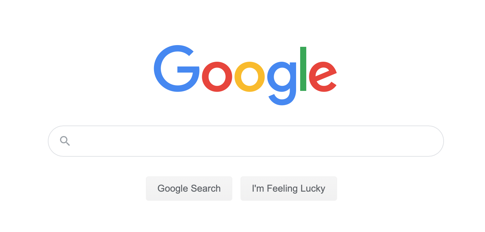
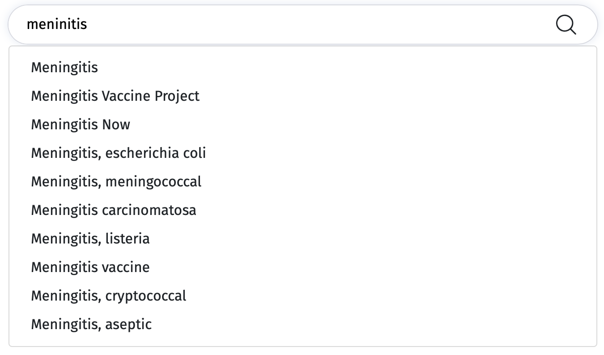

# Frontend Test

## Test 1

Create a static HTML page that looks like this famous one:

You are free to use whatever you want. You can find the logo here [test-1/google.png](test-1/google.png)

## Test 2

Create a web page that search from [Wikipedia API](https://en.wikipedia.org/w/api.php?action=help&modules=opensearch) to return a list of suggestions from a search input.
It should be something like this:

Use the technology you want (jQuery, ReactJS, AngularJs, VueJS, ...), do the UI you want.

## Test 3

Write two functions that compute the sum of the numbers in a given list using a for-loop, foreach-loop, a while-loop or a recursion.

## Test 4

Write a function that given a list of non negative integers, arranges them such that they form the largest possible number.

## Test 5

Write a function that computes the list of the first n Fibonacci numbers. By definition, the first two numbers in the Fibonacci sequence are 0 and 1, and each subsequent number is the sum of the previous two.

As an example, here are the first 10 Fibonnaci numbers: [0, 1, 1, 2, 3, 5, 8, 13, 21, 34].
